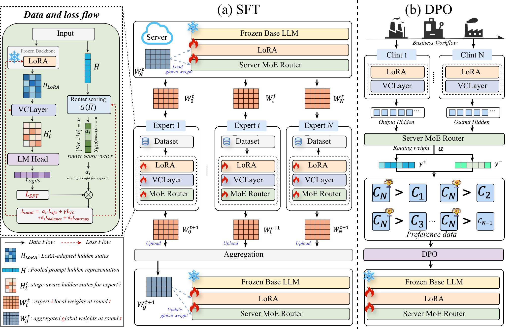
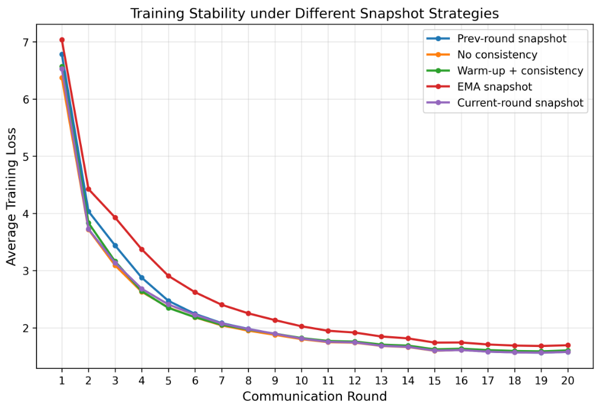

## 1. Figure 1. Redrawn overview of the training/inference pipeline.

## 2. Symbol / Notation Table
| Symbol | Meaning |
|---|---|
| $W_g^t$ | aggregated global weights at round $t$ |
| $W_i^t$ | local weights of expert $i$ at round $t$ |
| $W_g^{t+1}$ | updated global weights after aggregation |
| $W_i^{t+1}$ | updated local weights of expert $i$ |
| $C_N$ | top-ranked candidate response |
| $C_i$ | lower-ranked response from expert $i$ |

## 3. Training Stability under Different Snapshot Strategies for $\mathcal{L}\_{cons}$

